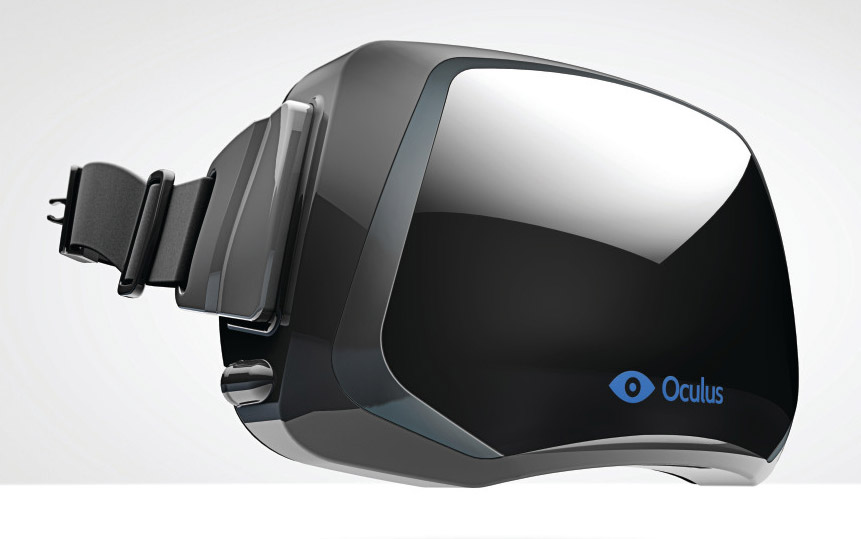

Virtual Reality (VR) is the new and upcoming technology that is capturing attention of individuals all over the world. VR uses high end computing software to generate realistic images, sounds, and motion activated control over a entertainment medium (i.e. games, videos etc.).

Currently, VR technology uses a portable headset that covers an individuals eyes with equipment capable of producing real-life like views, which can be controlled by movement of the individual. Some examples of VR technology are HTC's Vive and Oculus Rift. Other VR devices such as, Samsung VR and Google's Daydream Headset, a smartphone can be placed inside the headset to produce display

